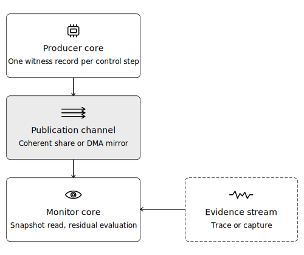
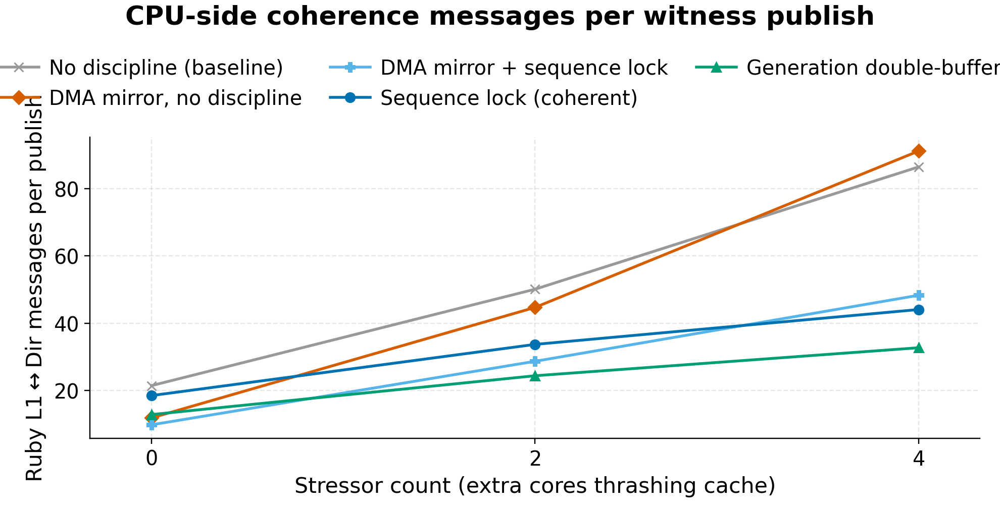
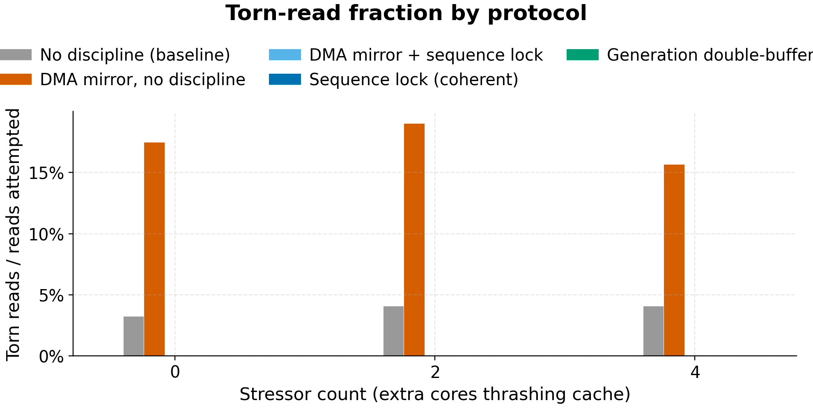
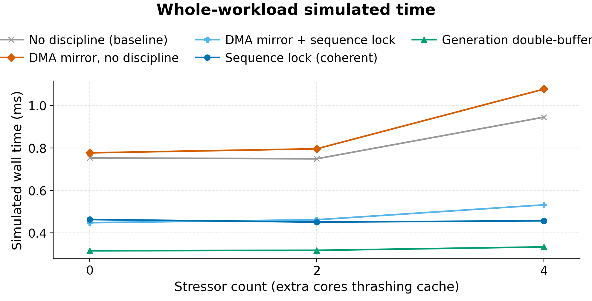

# Coherent Publication Channels for CPS Monitoring

This repository accompanies an architecture study of how a controller
should publish a 64-byte multi-field control record to a supervisory
monitor over a coherent multicore system.

The study uses gem5 ARM SE mode with Ruby `MESI_Two_Level`, a shared C11
publication library, two producer/consumer workloads, and a 30-cell
experimental matrix spanning five publication architectures, two
workload shapes, and three interference levels.

> **Coherence is the substrate, not the publication contract.**

The main result is that transport alone does not determine correctness.
Both direct coherent sharing and explicit transfer fail without an
explicit record-level publication primitive. Among the correct designs
evaluated here, generation-counter double buffering over direct coherent
sharing provides the best overall tradeoff.

## Project Overview

Supervisory monitors in cyber-physical systems require a timely and
logically consistent view of controller intent. On a multicore SoC,
shared coherent memory is an attractive export path, but coherence does
not make a multi-field control record atomic. A monitor can still
observe a mixed snapshot unless the record is published with an explicit
record-level synchronization discipline.

This repository studies that publication path as an architectural
problem. The monitor logic serves as the workload endpoint that makes
correctness and timing meaningful, but the contribution is the
characterization of the publication channel itself.

## System Overview

The producer publishes witness records, the monitor consumes them over a
shared-memory path, and the monitor compares them against an evidence
stream to compute a residual and a bounded-window temporal check.

<p align="center">
  
</p>

The record under study is a 64-byte control record containing an epoch,
timestamp, three actuation fields, and metadata. The architectural
question is how to publish that record so the monitor sees a correct
logical snapshot with low cost under contention.

## Experimental Design

The gem5 matrix evaluates five publication architectures:

| Architecture | Transport | Primitive |
| --- | --- | --- |
| `unsync` | coherent line | none |
| `seqlock` | coherent line | odd-even version |
| `dblbuf` | coherent slot pair | generation counter |
| `dma_naive` | DMA-pulled mirror | none |
| `dma_seqlock` | DMA-pulled mirror | odd-even version on mirror |

The workload set contains:

- `captured/periodic_suppression`, a sparse-divergence workload derived
  from a real per-period STM32 logic-analyzer capture
- `synthesized/duty_bias`, a sustained-bias workload generated from a
  nominal three-phase witness stream with a fixed `+15%`
  multiplicative evidence bias

The captured source trace used to regenerate the public workload is
vendored at
[impl/workloads/captured/source/verified_per_period.csv](impl/workloads/captured/source/verified_per_period.csv).

## Key Findings

The principal finding is that the publication primitive determines
correctness and strongly shapes cost.

One representative view from the matrix is CPU-side coherence traffic
per publish.

<p align="center">
  
</p>

Across the full 30-cell gem5 matrix:

- `unsync` and `dma_naive` produce torn snapshots in every workload and
  contention regime
- `seqlock`, `dblbuf`, and `dma_seqlock` eliminate torn reads in every
  measured cell
- `dblbuf` accepts `99.95%` of read attempts, compared with `97.85%`
  for `seqlock` and `8.03%` for `dma_seqlock`
- among the correct designs, `dblbuf` reduces average CPU-side
  coherence traffic by `27%` relative to `seqlock`
- `dblbuf` shortens whole-workload simulated time by `29%` relative to
  `seqlock` and by `28%` relative to `dma_seqlock`

Those whole-workload times are throughput-style cost proxies over
`5000` publications, not end-to-end latency distributions. The checked
in result matrix and the report make that distinction explicit.

Additional result views used by the report:

<p align="center">
  
</p>

<p align="center">
  
</p>

The result set used by the report is versioned under
[impl/results/gem5/matrix_full](impl/results/gem5/matrix_full).

## Reproduction

### Build the report

```text
make -C report
```

The built report is [report/main.pdf](report/main.pdf).

### Build the host-side implementation

```text
make -C impl core
make -C impl prototype
make -C impl workloads
```

This builds the shared C11 publication library, the pthread-based host
harness, and the workload CSVs used by both the host harness and the
gem5 workload.

### Run the gem5 workflow

The supported reproduction path is the Docker workflow under
[impl/gem5/docker](impl/gem5/docker). It requires an external gem5
checkout pointed to by `GEM5_SRC`.

```text
cd impl/gem5/docker
cp .env.example .env
# set GEM5_SRC=/abs/path/to/your/gem5 checkout
make image
make build-gem5
make build-m5
make build-workload
make smoke
make matrix
```

The top-level README keeps this workflow brief. The detailed gem5 and
Docker instructions are documented in
[impl/gem5/README.md](impl/gem5/README.md).

## Repository Structure

- [report/main.pdf](report/main.pdf): paper-sized project report
- [impl/](impl): implementation, workloads, gem5 setup, analysis, and
  results
- [impl/README.md](impl/README.md): implementation layout and local
  build targets
- [impl/gem5/README.md](impl/gem5/README.md): full gem5 and Docker
  workflow
- [impl/docs/](impl/docs): protocol, ordering, and metric
  specifications

## Scope Notes

- The checked-in gem5 matrix is curated and intentionally kept in
  version control because the report and plotting flow depend on it.
- The host prototype is a functional validation path, not a substitute
  for the ARM/gem5 experiments.
